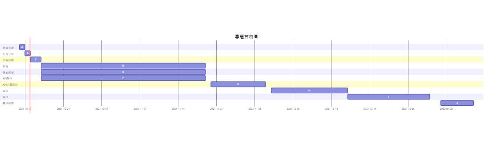

## 專題題目
Line Bot 提醒機器人

***
## 組員:
### C108118116 鄭中皓 (組長)
### C108118127 楊承翰
### C108118129 蕭有朋  
### C108118130 廖子瑋
### C108118137 何旻諺
### C108118148 賴泊丞
***
## 任務:
### 搜集資料-所有人
### 製作API-C108118116 鄭中皓 C108118127 楊承翰
### Line Bot程式撰寫-C108118129 蕭有朋 C108118130 廖子瑋
### 爬蟲-C108118137 何旻諺 C108118148 賴泊丞
***
## 內容:
學校的教學平台常有老師上課交代的事務和作業，會在繳交期限到期時寄信通知學生，但不是所有學生都會使用電子信箱，有時就算看到郵件也不會過於在意。

而Line是目前最被大眾使用的社交軟體，因此我們想開發利用Line平台通知學生課程資訊的聊天機器人，將作業及考試資訊以訊息的方式通知學生，也可以方便地透過機器人查詢其他課程的資訊。
***
## 甘特圖

***
## Pert/Cpm圖

***
