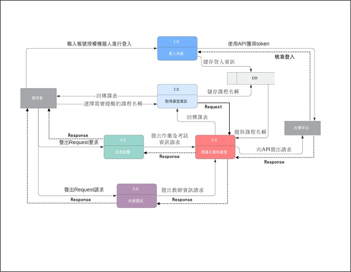

## 專題題目
Line Bot 提醒機器人

***
## 組員:
### C108118116 鄭中皓 (組長)
### C108118127 楊承翰
### C108118129 蕭有朋  
### C108118130 廖子瑋
### C108118137 何旻諺
### C108118148 賴泊丞
***
## 任務:
### 搜集資料-所有人
### 製作API-C108118116 鄭中皓 C108118127 楊承翰
### Line Bot程式撰寫-C108118129 蕭有朋 C108118130 廖子瑋
### 爬蟲-C108118137 何旻諺 C108118148 賴泊丞
***
## 內容:
學校的教學平台常有老師上課交代的事務和作業，會在繳交期限到期時寄信通知學生，但不是所有學生都會使用電子信箱，有時就算看到郵件也不會過於在意。

而Line是目前最被大眾使用的社交軟體，因此我們想開發利用Line平台通知學生課程資訊的聊天機器人，將作業及考試資訊以訊息的方式通知學生，也可以方便地透過機器人查詢其他課程的資訊。
***
## 甘特圖

***
## Pert/Cpm圖

***
## 功能分解圖

***
## 功能性/非功能性需求
功能性需求:
- 平時考試提醒
- 課堂作業公告
- 上課內容資料搜尋
- 課堂資訊公告

非功能性需求:
- 時間一到設定好的通知日期(e.g. 剩餘四天時通知)就即時傳遞Line訊息
- 可擴充性(利用Line Bot交作業)
- 可維護性

***
## 需求分析
1.可以提醒一些同學有什麼作業要交或未交

2.可以查詢老師、同學的聯絡方式(ex: e-mail、電話)

3.通知同學考試時間及作業繳交期限

***
## 使用案例圖

***
## 使用案例說明

| 使用案例名稱 |Line bot提醒機器人|
|:---|:---|
| 行動者 | 高科大學生 | 
| 說明 | 描述Line bot提醒過程 |
| 完成動作 |1.在Line中進行教學平台帳號密碼輸入 2.系統進行登入並寄送登入成功訊息 3.當有作業或考試期限快到時，系統主動傳送提醒訊息| 
| 替代方法 |1.在Line中進行教學平台帳號密碼輸入 2.系統進行登入並寄送登入失敗訊息| 
| 先決條件 | 學生需要先有教學平台的帳號 | 
| 後置條件 | 提醒過一天如未完成會再提醒一次 | 
| 假設 | 無 |

| 使用案例名稱 | 爬蟲機器人 |
|:---|:---|
| 行動者 | 系統 | 
| 說明 | 獲取學生課堂資訊 |
| 完成動作 |1.根據學生登入之帳號，系統主動爬取課堂資訊 2.傳送作業時間期限至Line bot機器人| 
| 替代方法 |1.根據學生登入之帳號，系統主動爬取課堂資訊 2.查無課堂作業資訊 3.傳送無作業提醒至Line bot機器人| 
| 先決條件 | 學生登入正確的帳號 | 
| 後置條件 | 系統回傳正確的課堂作業資訊 | 
| 假設 | 無 | 

| 使用案例名稱 | 課堂資訊 |
|:---|:---|
| 行動者 | 系統 | 
| 說明 | 描述課堂資訊應用過程 |
| 完成動作 |1.透過爬蟲獲取學生課堂資訊 2.提取各課堂的評分標準、老師相關資訊 3.回傳至Line bot供學生參考| 
| 替代方法 |1.透過爬蟲獲取學生課堂資訊 2.查無評分標準、老師相關資訊 3.回傳錯誤資訊後附上該堂教師介面| 
| 先決條件 | 學生登入正確的帳號 | 
| 後置條件 | 系統回傳正確的課堂資訊 | 
| 假設 | 無 | 

***

## DFD圖

***

***

## DFD 0

***
